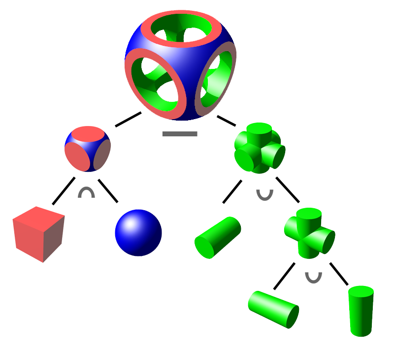
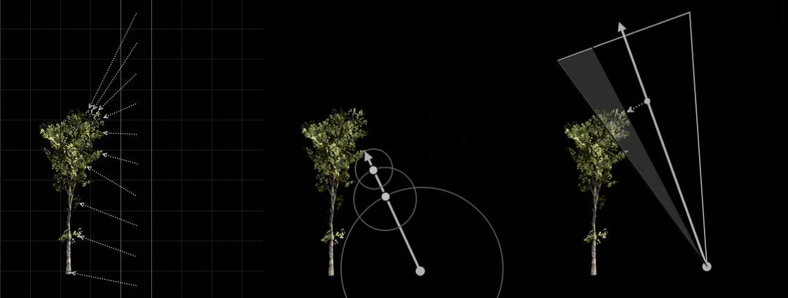

# Motivation

## Klassische Darstellung von 3D-Geometrie

In der Computergrafik werden dreidimensionale Objekte meist durch polygonale Netze beschrieben. Dabei wird die Oberfläche eines Modells durch eine Vielzahl kleiner Dreiecke approximiert. Diese Form der Geometrierepräsentation hat sich über viele Jahrzehnte hinweg etabliert und wird von moderner Grafik-Hardware direkt unterstützt. Aus diesem Grund bilden Polygonnetze die Grundlage nahezu aller heutigen Echtzeit-Rendering-Verfahren [@vc_geo].

Ein wesentlicher Vorteil polygonaler Netze liegt in ihrer Flexibilität. Sowohl einfache geometrische Körper als auch komplexe Modelle mit Millionen von Polygonen lassen sich auf diese Weise darstellen. Darüber hinaus existiert ein umfangreiches Ökosystem aus Modellierungswerkzeugen, Dateiformaten und Rendering-Pipelines, das auf dieser Repräsentation basiert.

## Grenzen polygonaler Netze

Trotz ihrer weiten Verbreitung sind Polygonnetze nicht für jede Anwendung die ideale Lösung. Da die Geometrie explizit durch Vertices und Dreiecke beschrieben wird, steigt der Speicherbedarf mit zunehmendem Detailgrad eines Modells. Besonders bei sehr komplexen oder fein strukturierten Oberflächen kann dies zu großen Datenmengen führen.

Auch die Modellierung mathematisch definierter Formen oder prozedural erzeugter Szenen gestaltet sich häufig aufwendiger. Sollen beispielsweise mehrere Grundkörper miteinander kombiniert oder komplexe geometrische Strukturen erzeugt werden, müssen die zugrunde liegenden Meshes entsprechend angepasst werden. Obwohl hierfür etablierte Verfahren existieren, kann die Verarbeitung schnell komplex werden.

Darüber hinaus beschreibt ein Polygonnetz ausschließlich die Oberfläche eines Objekts. Informationen über den umgebenden Raum, beispielsweise Abstände zu Oberflächen oder die Zugehörigkeit eines Punktes zum Inneren oder Äußeren eines Objekts, sind nicht unmittelbar verfügbar und müssen zusätzlich berechnet werden.

## Alternative Geometrierepräsentationen

Um einige dieser Einschränkungen zu umgehen, wurden verschiedene alternative Methoden zur Beschreibung von Geometrie entwickelt. Dazu zählen unter anderem Voxeldarstellungen, Punktwolken sowie implizite Oberflächen. Im Gegensatz zu Polygonnetzen wird die Geometrie hierbei nicht zwangsläufig durch eine Menge von Dreiecken beschrieben.

::: {.callout-note}
## Was ist eine Signed Distance Function?

Signed Distance Functions (SDFs) gehören zu den impliziten Geometrierepräsentationen. Anstatt die Oberfläche eines Objekts direkt zu speichern, wird eine Funktion definiert, die jedem Punkt im Raum einen signierten Abstand zur nächstgelegenen Oberfläche zuordnet. Die eigentliche Geometrie ergibt sich somit indirekt aus dieser Funktion.
:::

Da bei diesem Ansatz keine expliziten Dreiecke vorhanden sind, können klassische Rasterisierungsverfahren nicht unmittelbar angewendet werden. Stattdessen kommen häufig Ray-Marching-Verfahren zum Einsatz. Dabei werden Strahlen schrittweise durch die Szene verfolgt, bis eine Oberfläche gefunden wird. Die in der Signed Distance Function enthaltenen Distanzinformationen ermöglichen dabei eine effiziente Bestimmung der nächsten Schrittweite.

Die Kombination aus Signed Distance Functions und Ray Marching hat sich insbesondere für prozedurale Szenen, mathematische Modelle und experimentelle Rendering-Techniken als interessante Alternative zu klassischen Polygonnetzen etabliert [@quilez_distfunctions; @wong2016].

# Typische Anwendungsgebiete

## Prozedurale Modellierung

Ein häufiges Einsatzgebiet von Signed Distance Functions ist die prozedurale Erzeugung von Geometrie. Anstatt Objekte manuell zu modellieren und als Polygonnetz zu speichern, werden Formen durch mathematische Funktionen beschrieben und zur Laufzeit generiert. Dadurch lassen sich komplexe Szenen und Modelle mit vergleichsweise wenig Speicheraufwand erzeugen. Typische Beispiele sind Landschaften, Höhlensysteme oder abstrakte, algorithmisch erzeugte Welten und Sci-Fi-Strukturen. Änderungen an Parametern führen unmittelbar zu neuen Geometrien, ohne dass Modelle neu erstellt werden müssen.

```{=html}
<div class="demo-wide">
<iframe
  src="../assets/demos/prozedurale-landschaft/index.html"
  height="610"
  scrolling="yes"
  title="Prozedurale Landschaft">
</iframe>
</div>
```

## Unendliche Wiederholung von Objekten

Ein besonders eindrucksvolles Beispiel prozeduraler Geometrie ist die Domain-Repetition mit `mod()`: Ein einzelnes SDF-Objekt wird durch eine Faltung des Koordinatenraums unendlich oft wiederholt, ohne Mehraufwand zur Laufzeit [@quilez_distfunctions]. In der folgenden Demo fliegt die Kamera automatisch durch das Feld; Farben, Schatten und Ambient Occlusion werden prozedural berechnet.

```{=html}
<div class="demo-wide">
<iframe
  src="../assets/demos/unendliche-repetition/index.html"
  height="560"
  scrolling="no"
  title="Unendliche Repetition">
</iframe>
</div>
```

## Constructive Solid Geometry

Signed Distance Functions eignen sich besonders gut für Constructive Solid Geometry (CSG). Dabei werden komplexe Objekte aus einfachen Grundkörpern wie Kugeln, Würfeln oder Zylindern zusammengesetzt. Operationen wie Vereinigung, Schnittmenge oder Differenz können direkt auf den zugrunde liegenden Distanzfunktionen formuliert werden. Dies ermöglicht eine flexible und elegante Modellierung komplexer Geometrien, ohne dass Polygonnetze aufwendig miteinander verschmolzen oder neu trianguliert werden müssen.

{#fig-csg width="30%"}

::: {.column-margin}
**Quelle:** <https://en.wikipedia.org/wiki/Constructive_solid_geometry>
:::

## Fraktale und mathematische Strukturen

Ein weiterer Anwendungsbereich ist die Darstellung mathematisch definierter Objekte und Fraktale. Bekannte Beispiele sind die Mandelbulb oder die Mandelbox. Solche Strukturen weisen häufig eine sehr hohe geometrische Komplexität und feine Details auf, die mit klassischen Polygonnetzen nur schwer darstellbar wären. Durch die mathematische Beschreibung der Geometrie eignen sich SDF-basierte Verfahren besonders gut für die Visualisierung solcher Formen.

```{=html}
<div class="demo-wide">
<iframe
  src="../assets/demos/menger-schwamm/index.html"
  height="580"
  scrolling="no"
  title="Menger-Schwamm">
</iframe>
</div>
```

## Echtzeit-Rendering und Demo-Szene

Große Bekanntheit erlangten Signed Distance Functions durch die Demo-Szene und moderne Shader-Programmierung. Da sich komplexe Geometrie direkt im Shader beschreiben lässt, können beeindruckende Szenen mit vergleichsweise wenig Programmcode erzeugt werden. Besonders bei sogenannten 4k- oder 64k-Intros, bei denen die gesamte Anwendung nur wenige Kilobyte groß sein darf, bieten SDFs erhebliche Vorteile gegenüber gespeicherter Polygongeometrie. Darüber hinaus kommen SDFs häufig in Shader-Plattformen wie ShaderToy zum Einsatz, um prozedurale Szenen vollständig auf der GPU zu erzeugen.

Das folgende Video zeigt eine Demo aus der 4K-Kategorie der Demoszene. Dieses Werk des Künstlers „reptile“ basiert auf einer lediglich 4 kB großen kompilierten ausführbaren Datei. Um trotz der extremen Größenbeschränkung komplexe 3D-Szenen zu erzeugen, werden keine vorgefertigten Modelle oder Texturen gespeichert. Stattdessen werden Geometrien mithilfe mathematischer Funktionen - unter anderem Signed Distance Functions - prozedural zur Laufzeit erzeugt und per Ray Marching gerendert.

<div style="position: relative; padding-bottom: 56.25%; height: 0;">
  <iframe
    src="https://www.youtube.com/embed/roZ-Cgxe9bU"
    style="position:absolute; top:0; left:0; width:100%; height:100%;"
    frameborder="0"
    allowfullscreen>
  </iframe>
</div>


::: {.column-margin}
**Quelle:** <https://www.youtube.com/watch?v=roZ-Cgxe9bU>
:::

## Weitere Beispiele für moderne Anwendungen von SDFs in Industrie und Forschung

::: {.grid}

::: {.g-col-12 .g-col-md-6}
::: {.feature-card}
**Mesh Distance Fields (Unreal Engine)**

Distanzfelder ermöglichen effiziente Berechnung von Ambient Occlusion, weichen Schatten und Global Illumination
:::
:::

::: {.g-col-12 .g-col-md-6}
::: {.feature-card}
**3D-Rekonstruktion**

TSDFs und moderne Neural-SDF-Verfahren rekonstruieren hochauflösende 3D-Modelle aus Tiefen- oder Bilddaten.
:::
:::

::: {.g-col-12 .g-col-md-6}
::: {.feature-card}
**Robotik**

Distanzfelder unterstützen Kollisionsabfragen und Bewegungsplanung, indem sie den Abstand zu Hindernissen effizient bereitstellen.
:::
:::

::: {.g-col-12 .g-col-md-6}
::: {.feature-card}
**Schrift- und UI-Rendering**

SDF- und MSDF-Fonts ermöglichen scharfe, beliebig skalierbare Schrift sowie Icons und UI-Elemente.
:::
:::

:::

{#fig-sdf-industrie width="70%"}

::: {.column-margin}
**Quelle:** <https://dev.epicgames.com/documentation/unreal-engine/mesh-distance-fields-in-unreal-engine>
:::

## Einordnung

Trotz ihrer vielseitigen Einsatzmöglichkeiten haben Signed Distance Functions klassische Polygonnetze bislang nicht ersetzt. Moderne Grafik-Hardware ist weiterhin stark auf die Verarbeitung polygonaler Geometrie optimiert, weshalb Meshes in den meisten Echtzeit-Anwendungen dominieren. SDFs werden daher vor allem in Bereichen eingesetzt, in denen ihre mathematische Beschreibung und die daraus resultierende Flexibilität besondere Vorteile bieten.

# Historischer Überblick

Die Idee, Geometrie durch mathematische Funktionen zu beschreiben, reicht deutlich weiter zurück als moderne Echtzeit-Rendering-Verfahren. Bereits in frühen Arbeiten zu impliziten Oberflächen wurden Formen nicht durch Polygonnetze dargestellt, sondern durch Funktionen definiert, deren Nullstellen die Oberfläche eines Objekts beschreiben. Solche Ansätze wurden vor allem im wissenschaftlichen Umfeld und in der geometrischen Modellierung untersucht.

Im Laufe der Zeit entstand das Konzept von Distanzfunktionen, bei denen nicht nur die Lage einer Oberfläche, sondern auch der Abstand zu ihr beschrieben wird. Daraus entwickelten sich schließlich Signed Distance Functions, die zusätzlich zwischen Punkten innerhalb und außerhalb eines Objekts unterscheiden können. Diese Repräsentation erwies sich als besonders nützlich, da sie neben der Beschreibung der Geometrie auch Informationen über den umgebenden Raum bereitstellt.

Ein entscheidender Meilenstein folgte 1996 mit der Veröffentlichung des Sphere-Tracing-Verfahrens durch John C. Hart [@hart1996]. Die grundlegende Idee bestand darin, die in einer Signed Distance Function enthaltenen Abstandsinformationen zu nutzen, um Strahlen effizient durch eine Szene zu verfolgen. Im Gegensatz zu klassischen Verfahren kann dabei die Schrittweite eines Strahls direkt aus der Distanz zur nächsten Oberfläche abgeleitet werden.

Die Kombination aus Signed Distance Functions und Sphere Tracing bildet bis heute die theoretische Grundlage vieler Ray-Marching-Verfahren und stellt einen wichtigen Entwicklungsschritt im Bereich impliziter Geometrierepräsentationen dar.

# Quellenverzeichnis {.unnumbered}

::: {#refs}
:::