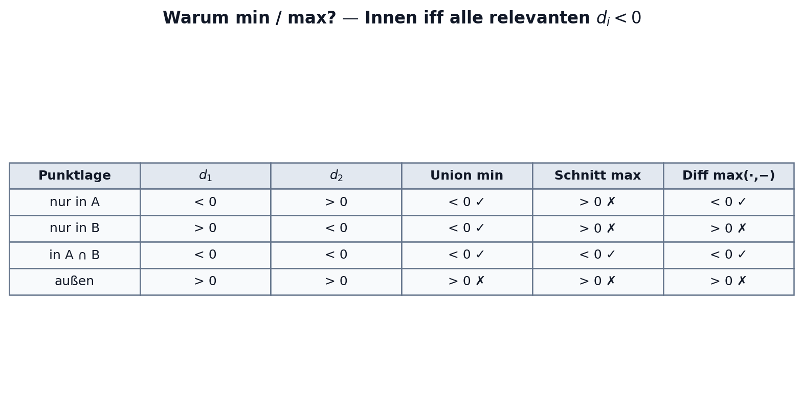
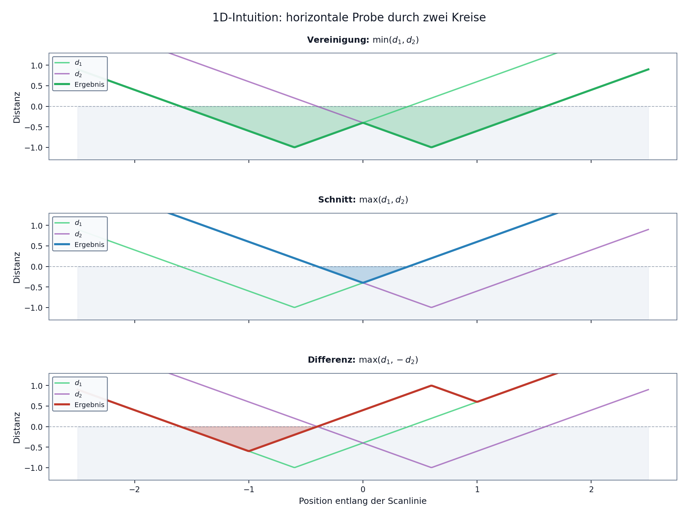
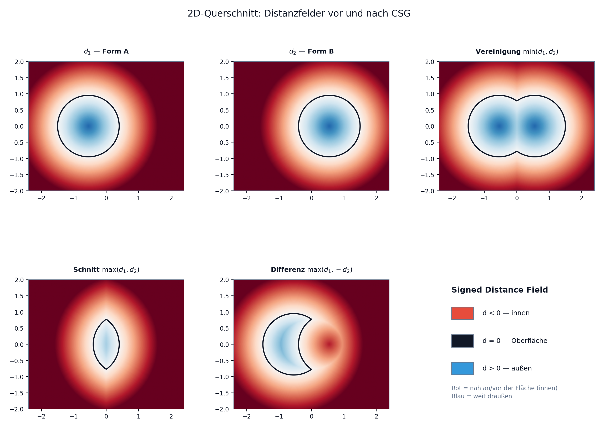
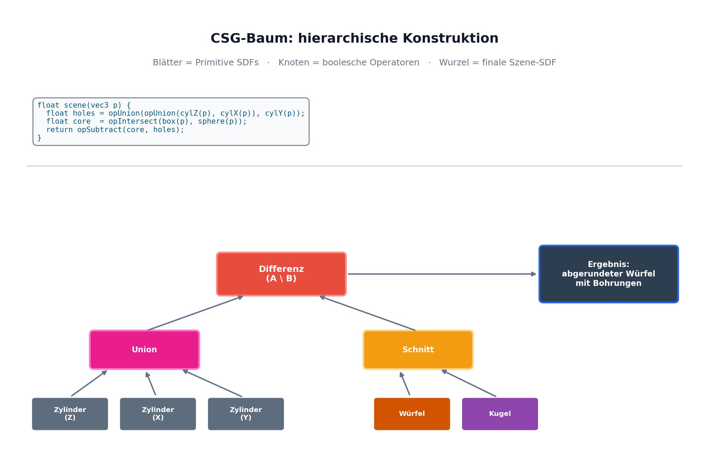
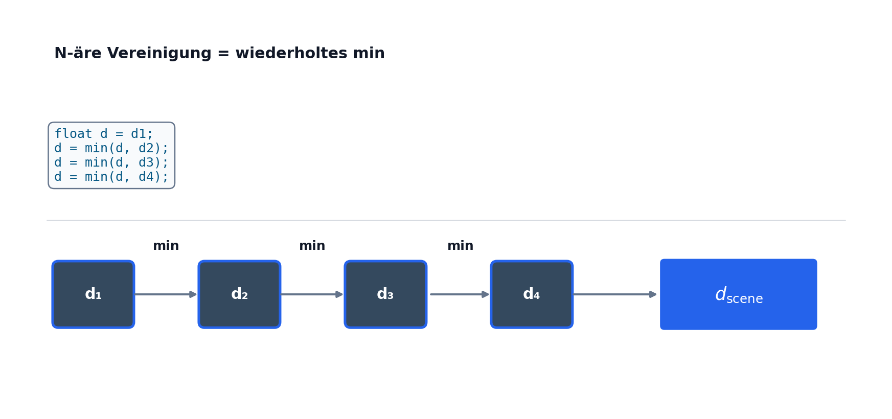
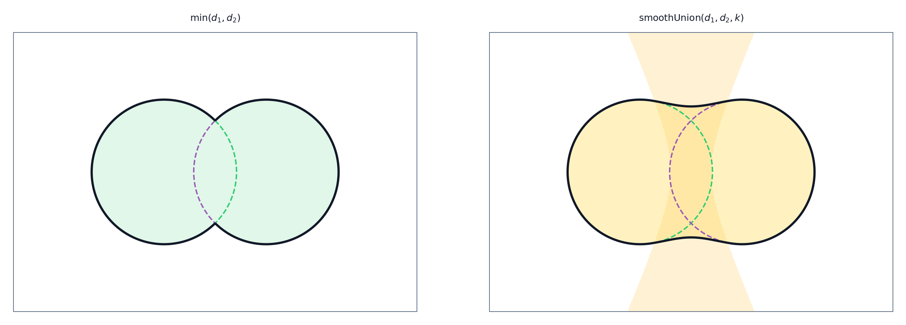
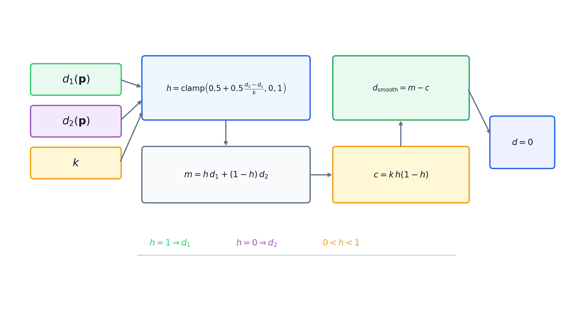
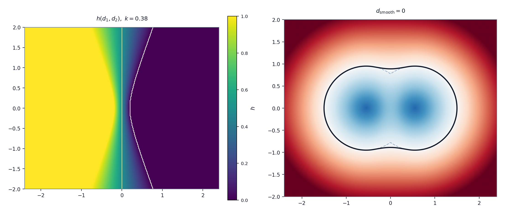

# Einführung in CSG

## Was ist Constructive Solid Geometry (CSG)?

- **Grundidee:** Konstruktion komplexer Festkörper aus einfachen geometrischen Primitiven (Kugel, Quader, Zylinder, ...).
- **Prinzip:** Verknüpfung durch boolesche Operationen (Vereinigung, Schnitt, Differenz).
- **Speicherformat:** Die Form wird nicht als Polygonnetz (Mesh) gespeichert, sondern als prozeduraler **Ausdrucksbaum** (CSG-Baum).

\vspace{0.4em}

**Vorteile von CSG:**
- **Unendliche Präzision:** Die Form ist exakt mathematisch definiert (Auflösungsunabhängig).
- **Garantierte Volumina:** Immer geschlossene ("watertight") Körper, wichtig für CAD und 3D-Druck.
- **Parametrisierbarkeit:** Jeder Modellierungsschritt ist nicht-destruktiv und nachträglich änderbar.

# Mathematische Grundlagen

## Von Mengenlehre zu R-Funktionen

Körper werden mathematisch als Punktmengen im $\mathbb{R}^3$ betrachtet. 
Für Operationen auf diesen Mengen brauchen wir die **Mengentheorie**:
- Vereinigung: $A \cup B$ (alles in A oder B)
- Schnittmenge: $A \cap B$ (nur in A und B)
- Differenz: $A \setminus B$ (in A, aber nicht in B)

\vspace{0.4em}

**R-Funktionen (Rvachev-Funktionen):**
Um von abstrakten Mengen auf berechenbare Funktionen (wie Distanzfelder) zu kommen, nutzt man R-Funktionen. Diese übersetzen boolesche Logik in kontinuierliche reellwertige Funktionen.

Für eine Funktion $f(\mathbf{p})$, bei der $f(\mathbf{p}) < 0$ das Innere des Körpers definiert, liefern $\min$ und $\max$ genau diese Übersetzung.

## SDF-Funktionen

{\small

\[
\begin{aligned}
d_{\text{Kugel}}(\mathbf p)
  &= \|\mathbf p-\mathbf c\| - r \\[0.45em]
\mathbf q_{\text{Box}}
  &= |\mathbf p-\mathbf c|-\mathbf b \\
d_{\text{Box}}(\mathbf p)
  &= \|\max(\mathbf q_{\text{Box}},\mathbf 0)\|
     + \min(\max(q_x,q_y,q_z),0) \\[0.45em]
\mathbf q_{\text{Zyl}}
  &= \left(
       \sqrt{(p_x-c_x)^2+(p_z-c_z)^2},
       |p_y-c_y|
     \right) - (r,h) \\
d_{\text{Zylinder}}(\mathbf p)
  &= \|\max(\mathbf q_{\text{Zyl}},\mathbf 0)\|
     + \min(\max(q_x,q_y),0) \\[0.45em]
\mathbf q_{\text{Torus}}
  &= \left(
       \sqrt{(p_x-c_x)^2+(p_z-c_z)^2}-R,
       p_y-c_y
     \right) \\
d_{\text{Torus}}(\mathbf p)
  &= \|\mathbf q_{\text{Torus}}\| - r
\end{aligned}
\]

\[
\begin{aligned}
d_{A\cup B}(\mathbf p) &= \min(d_A(\mathbf p),d_B(\mathbf p)) \\
d_{A\cap B}(\mathbf p) &= \max(d_A(\mathbf p),d_B(\mathbf p)) \\
d_{A\setminus B}(\mathbf p) &= \max(d_A(\mathbf p),-d_B(\mathbf p))
\end{aligned}
\]

}

## Boolesche Funktionen

{\small

\[
\begin{aligned}
\mathbf p \in A
  &\Longleftrightarrow d_A(\mathbf p) < 0 \\[0.45em]
\mathbf p \in A \cup B
  &\Longleftrightarrow (d_A(\mathbf p)<0)\lor(d_B(\mathbf p)<0)
   \Longleftrightarrow \min(d_A,d_B)<0 \\[0.45em]
\mathbf p \in A \cap B
  &\Longleftrightarrow (d_A(\mathbf p)<0)\land(d_B(\mathbf p)<0)
   \Longleftrightarrow \max(d_A,d_B)<0 \\[0.45em]
\mathbf p \in A \setminus B
  &\Longleftrightarrow (d_A(\mathbf p)<0)\land\neg(d_B(\mathbf p)<0)
   \Longleftrightarrow \max(d_A,-d_B)<0
\end{aligned}
\]

\[
\begin{aligned}
f_{\cup}(d_A,d_B) &= \min(d_A,d_B) \\
f_{\cap}(d_A,d_B) &= \max(d_A,d_B) \\
f_{\setminus}(d_A,d_B) &= \max(d_A,-d_B)
\end{aligned}
\]

}

## Die drei Kernoperationen algebraisch

Für zwei Körper, definiert durch ihre Funktionen $d_1(\mathbf{p})$ und $d_2(\mathbf{p})$:

\begin{align*}
\text{Union:}        \quad d(\mathbf{p}) &= \min\bigl(d_1(\mathbf{p}), d_2(\mathbf{p})\bigr) \\
\text{Intersection:}\quad d(\mathbf{p}) &= \max\bigl(d_1(\mathbf{p}), d_2(\mathbf{p})\bigr) \\
\text{Difference:}   \quad d(\mathbf{p}) &= \max\bigl(d_1(\mathbf{p}), -d_2(\mathbf{p})\bigr)
\end{align*}

\vspace{0.3em}

**Warum funktioniert das?**
- **Min / Max:** Ein Punkt ist genau dann im Schnittbereich ($\max$), wenn *beide* Ursprungswerte $<0$ sind. Er ist in der Vereinigung ($\min$), wenn *mindestens einer* $<0$ ist.
- **Invertierung:** $-d_2$ spiegelt das Innere und Äußere von $B$. Das "Herausschneiden" ($A \setminus B$) wird mathematisch zum Schnitt von $A$ mit dem invertierten $B$: $A \cap \overline{B}$.

## Algebraische Eigenschaften

Da CSG-Operationen auf $\min$ und $\max$ basieren, erben sie deren algebraische Gesetze:

- **Kommutativität:** 
  $\min(A, B) = \min(B, A)$ 
  (Die Reihenfolge bei der Vereinigung ist egal)
- **Assoziativität:** 
  $\min(A, \min(B, C)) = \min(\min(A, B), C)$ 
  (Erlaubt die einfache Verkettung vieler Objekte)
- **Distributivität:** 
  $\max(A, \min(B, C)) = \min(\max(A, B), \max(A, C))$
- **De Morgansche Gesetze:** 
  $-( \min(A, B) ) = \max(-A, -B)$
  (Das Invertieren einer Vereinigung entspricht dem Schnitt der invertierten Einzelkörper)

# Visuelle Interpretation

## Inside/Outside-Logik im Detail

Ein Punkt liegt **innen**, wenn $d < 0$ (negativ = im Körper).

{width=92%}

\small
- **Union:** min wählt die *nähere* Fläche $\rightarrow$ innen, wenn *mindestens eine* Form innen ist.
- **Schnitt:** max verlangt, dass *beide* Distanzen negativ sind (der Punkt muss in beiden Körpern liegen).

## 1D-Scanline: min / max sichtbar machen

{width=100%}

\footnotesize
Horizontale Probe durch zwei Kreise: $d_1$, $d_2$ und das kombinierte Feld. Rot schattiert = $d \le 0$ (innen).

## Distanzfelder vor und nach CSG

{width=100%}

\footnotesize
Weiße Kontur = Nullniveau ($d=0$) = Oberfläche. Man sieht, wie $\min$ und $\max$ die skalaren Felder im Raum kombinieren. Die Operation wertet nicht nur Ränder aus, sondern den gesamten Raum.

# Der CSG-Baum

## Hierarchische Konstruktion

{width=100%}

\footnotesize
Blätter = Primitive · innere Knoten = Operatoren · Wurzel = Gesamtfunktion `scene(p)` für den aktuellen Punkt $\mathbf{p}$.

## N-äre Operationen und Verkettung

{width=88%}

\vspace{0.3em}

Dank der **Assoziativität** können wir hunderte Primitiven als Liste oder flachen Baum zusammenfassen:
$\min(d_1, \min(d_2, \min(d_3, \dots)))$

Dies vermeidet bei der Auswertung tiefe Rekursionen und ist hochgradig optimierbar für GPUs.

# Erweiterung: Mathematische Glättung (Smooth CSG)

## Das Problem harter Kanten

Klassisches CSG erzeugt exakte C0-stetige Übergänge (scharfe Kanten) an den Schnittstellen. In vielen Anwendungen (z.B. organisches Design, Aerodynamik) benötigt man glatte Übergänge.

Dank der mathematischen Repräsentation können wir die Operationen $\min$ und $\max$ durch **"Smooth Minimum/Maximum"**-Funktionen ersetzen:

```glsl
float smoothUnion(float d1, float d2, float k) {
  float h = clamp(0.5 + 0.5*(d2-d1)/k, 0.0, 1.0);
  return mix(d2, d1, h) - k*h*(1.0-h);
}
```

\vspace{0.2em}
Hierbei steuert $k$ den Radius der Glättung.

## Smooth Union: Idee

{width=100%}

## Smooth Union: Rechnung

{width=100%}

## Smooth Union: h im Feld

{width=96%}

## Ableitungs-Sicht (warum „smooth“?)

Im Inneren des Blend-Bands ist die Ableitung der Smooth-Union-Funktion $d_s$:
\[
\nabla d_s = \alpha\,\nabla d_1 + (1-\alpha)\,\nabla d_2,\quad \alpha\in[0,1].
\]
\vspace{0.3em}

**Ergebnis:** 
Die Oberflächennormale ($\nabla d$) springt nicht mehr abrupt zwischen $\nabla d_1$ und $\nabla d_2$. Stattdessen wird sie mathematisch kontinuierlich gemischt (C1-Stetigkeit). Das ergibt perfekte "Fillets" ohne komplexe Mesh-Algorithmen.

# Zusammenfassung & Ausblick

## Warum CSG so mächtig ist

| Eigenschaft | Erklärung |
|---|---|
| **Echtes Volumen** | Körper sind garantiert massiv, niemals nur eine Hülle. |
| **Robustheit** | Keine kaputten Topologien, keine verschwindenden Dreiecke wie bei Mesh-Booleans. |
| **Kompaktheit** | Eine komplexe Szene benötigt nur wenige Bytes Code (der CSG-Baum). |
| **Analytisch** | Perfekt berechenbare Oberflächennormalen via Gradienten ($\nabla d$). |

\vspace{0.8em}
CSG ist das fundamentale Rückgrat moderner CAD-Systeme und prozeduraler Generierung!

\vspace{0.8em}
\centering
\large Fragen zu CSG?

